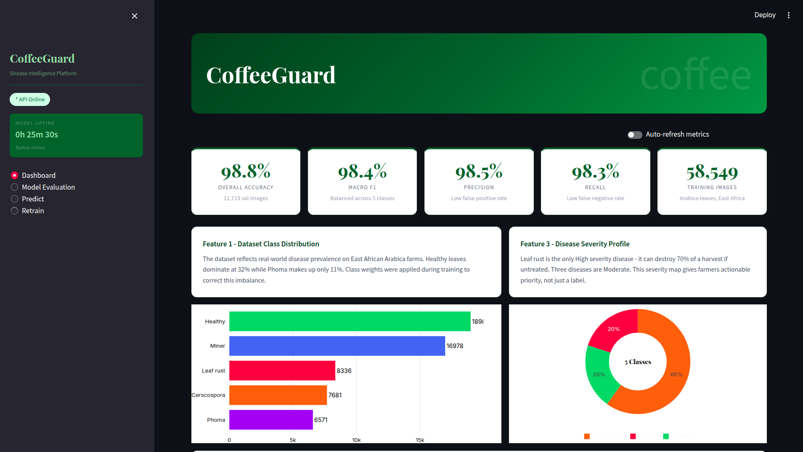
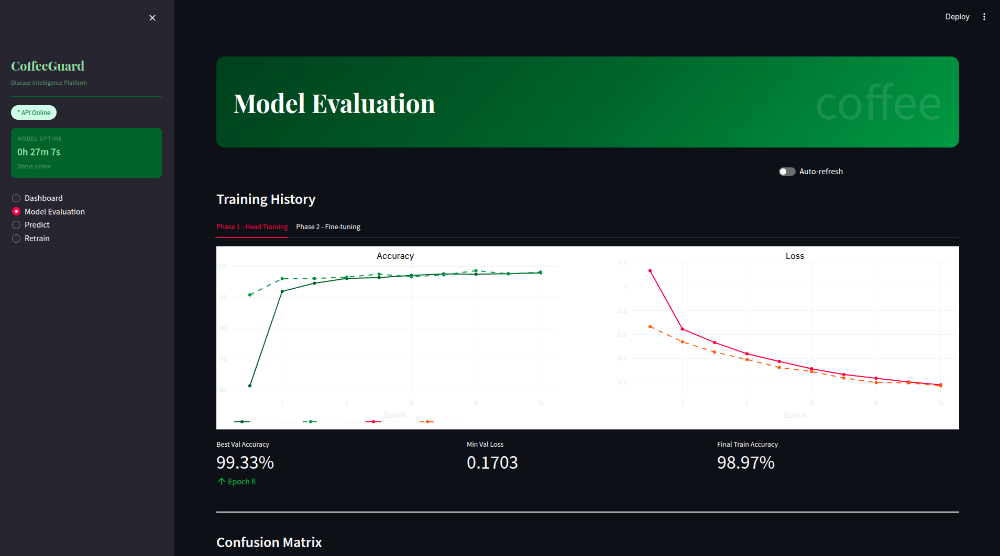
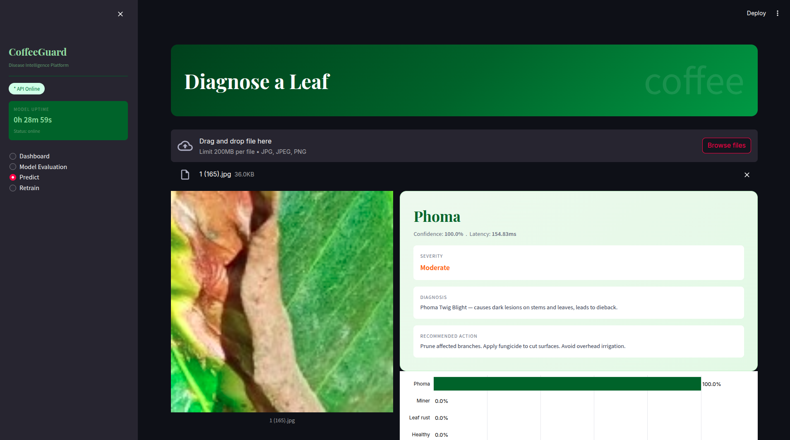
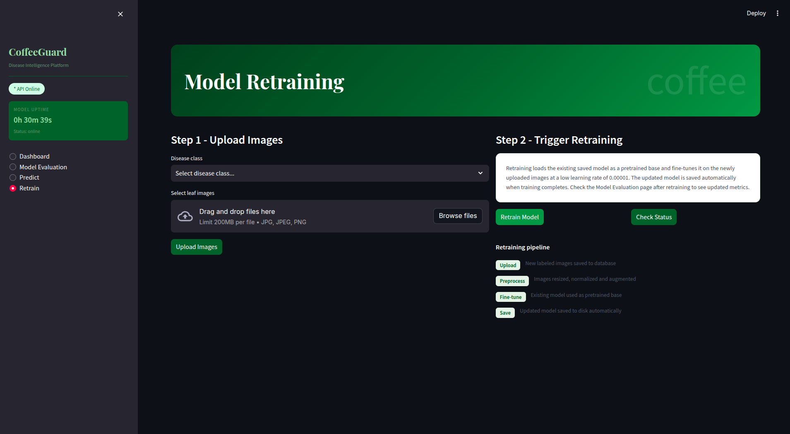
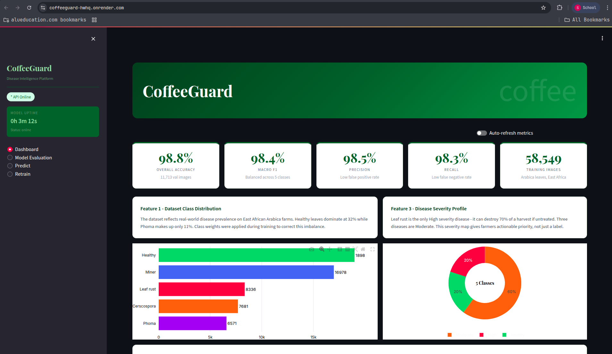
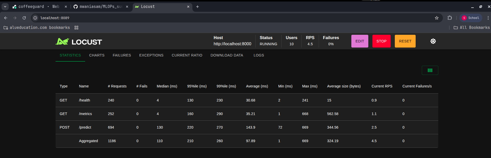
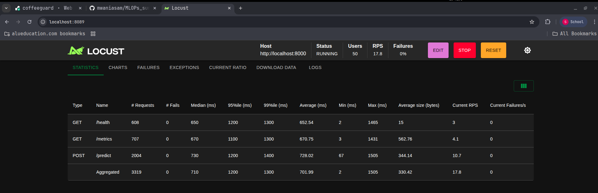

# CoffeeGuard — Arabica Coffee Leaf Disease Classifier

An end-to-end Machine Learning pipeline that detects diseases in Arabica coffee leaves from images. Built with MobileNetV2 transfer learning, deployed on Render with a Streamlit dashboard, FastAPI backend, SQLite database, and full retraining support.

Coffee is Rwanda's most important agricultural export, supporting over 400,000 smallholder farming families. Diseases like Coffee Leaf Rust can destroy up to 70% of a harvest. Most farmers have no access to a plant pathologist. This tool gives them a diagnosis from a single photo.

---

## Video Demo

YouTube: YOUR_YOUTUBE_LINK_HERE

---

## Live Application

```
https://coffeeguard-hwhq.onrender.com
```

---

## Screenshots

### Dashboard


### Model Evaluation


### Prediction


### Retrain


### Live on Render


---

## Dataset

**Arabica Coffee Leaf Disease Dataset (JMuBEN)**
- Total images: 58,549
- Classes: 5
- Source: https://www.kaggle.com/datasets/noamaanabdulazeem/jmuben-coffee-dataset

| Class | Images | Severity | Description |
|---|---|---|---|
| Healthy | 18,983 | None | No disease present |
| Miner | 16,978 | Moderate | Leaf Miner - insect damage causing tunnels |
| Leaf rust | 8,336 | High | Most damaging disease, causes up to 70% yield loss |
| Cerscospora | 7,681 | Moderate | Brown spots with yellow halo |
| Phoma | 6,571 | Moderate | Dark lesions on stems and leaves |

---

## Model Performance

| Metric | Score |
|---|---|
| Overall Accuracy | 98.80% |
| Macro F1 Score | 98.36% |
| Weighted F1 Score | 98.78% |
| Macro Precision | 98.50% |
| Macro Recall | 98.31% |
| Best Val Accuracy | 99.33% |

---

## Project Structure

```
MLOPs_summative/
|
|-- README.md
|-- .gitignore
|-- requirements.txt
|-- Dockerfile
|-- docker-compose.yml
|-- locustfile.py
|-- streamlit_app.py
|-- start.sh
|
|-- notebook/
|   +-- coffee_disease_checker.ipynb
|
|-- src/
|   |-- preprocessing.py
|   |-- model.py
|   +-- prediction.py
|
|-- app/
|   |-- main.py
|   |-- database.py
|   |-- routes/
|   |   |-- predict.py
|   |   |-- retrain.py
|   |   +-- metrics.py
|   +-- frontend/
|       +-- index.html
|
|-- data/
|   |-- train/
|   +-- test/
|
|-- models/
|   +-- coffeeguard_model.h5
|
+-- docs/
    +-- screenshots/
```

---

## Setup Instructions

### Requirements
- Python 3.12+
- Docker and Docker Compose
- Git

### 1. Clone the repository

```bash
git clone https://github.com/mwaniasam/MLOPs_summative.git
cd MLOPs_summative
```

### 2. Download the dataset

Download from Kaggle:
```
https://www.kaggle.com/datasets/noamaanabdulazeem/jmuben-coffee-dataset
```

Organize into:
```
data/
  train/
    Cerscospora/
    Healthy/
    Leaf rust/
    Miner/
    Phoma/
  test/
    Cerscospora/
    Healthy/
    Leaf rust/
    Miner/
    Phoma/
```

### 3. Train the model

Open `notebook/coffee_disease_checker.ipynb` on Kaggle with GPU T4 enabled. Run all cells. Download `coffeeguard_model.h5` into the `models/` folder.

### 4. Run with Docker

```bash
docker-compose up --build
```

- Streamlit UI: http://localhost:8501
- FastAPI: http://localhost:8000
- API docs: http://localhost:8000/docs

### 5. Run locally without Docker

```bash
pip install -r requirements.txt

# Start FastAPI
uvicorn app.main:app --host 0.0.0.0 --port 8000 &

# Start Streamlit
streamlit run streamlit_app.py --server.port 8501
```

---

## API Endpoints

| Method | Endpoint | Description |
|---|---|---|
| GET | /health | Health check |
| GET | /metrics | Model performance metrics and uptime |
| POST | /predict | Predict disease from an uploaded image |
| POST | /upload | Upload images for retraining (saved to database) |
| GET | /uploads | List all uploaded images from database |
| POST | /retrain | Trigger model retraining in background |
| GET | /retrain/status | Check retraining status |
| GET | /retrain/history | View retraining history from database |

---

## UI Features

### Dashboard
- Model uptime display
- Overall accuracy, F1, precision and recall metrics
- Dataset class distribution chart
- Per-class F1, precision and recall bar charts
- Disease severity profile pie chart
- Model performance radar chart
- Training progress chart across both training phases

### Model Evaluation
- Phase 1 and Phase 2 training curves (accuracy and loss)
- Confusion matrix with raw counts and percentages
- ROC curves for all 5 classes with AUC scores
- Full classification report table

### Predict
- Upload a single leaf image
- Instant disease classification with confidence score
- Severity level and recommended action
- Probability distribution chart across all classes

### Retrain
- Upload multiple images per class - saved to SQLite database
- Trigger retraining with one button click
- Real-time status monitoring
- Retraining history from database

---

## Load Testing Results

Load testing performed with Locust against the local Docker deployment.

### 1 Container - 10 Users



| Endpoint | Avg Latency | Max Latency | RPS | Failures |
|---|---|---|---|---|
| POST /predict | 143.9ms | 669ms | 2.5 | 0% |
| GET /health | 30.68ms | 241ms | 0.9 | 0% |
| GET /metrics | 35.21ms | 668ms | 1.1 | 0% |
| **Aggregated** | **97.89ms** | **669ms** | **4.5** | **0%** |

### 1 Container - 50 Users



| Endpoint | Avg Latency | Max Latency | RPS | Failures |
|---|---|---|---|---|
| POST /predict | 728.02ms | 1505ms | 10.7 | 0% |
| GET /health | 652.54ms | 1465ms | 3.0 | 0% |
| GET /metrics | 670.75ms | 1431ms | 4.1 | 0% |
| **Aggregated** | **701.99ms** | **1505ms** | **17.8** | **0%** |

### 2 Containers - 50 Users


| Endpoint | Avg Latency | Max Latency | RPS | Failures |
|---|---|---|---|---|
| POST /predict | 709.99ms | 2002ms | 10.7 | 0% |
| GET /health | 624.23ms | 1949ms | 4.0 | 0% |
| GET /metrics | 608.25ms | 1941ms | 2.8 | 0% |
| **Aggregated** | **672.16ms** | **2002ms** | **17.5** | **0%** |

Key observations:
- Zero failures across all test scenarios
- Single container handles 10 users with sub-100ms average latency
- At 50 users latency increases to ~700ms - acceptable for a CPU-only inference server
- Two containers show marginally lower average latency at 50 users
- The prediction endpoint dominates latency due to TensorFlow CPU inference

---

## Deployment

Deployed on Render using Docker. The container runs both FastAPI (port 8000) and Streamlit (port 8501). Render serves Streamlit as the primary interface.

To deploy your own instance:
1. Fork this repository
2. Create a new Web Service on Render
3. Connect your GitHub repository
4. Set Runtime to Docker
5. Add environment variable: MODEL_PATH = models/coffeeguard_model.h5
6. Deploy

---

## Author

Samuel Mwania
BSc Software Engineering, African Leadership University
GitHub: https://github.com/mwaniasam
